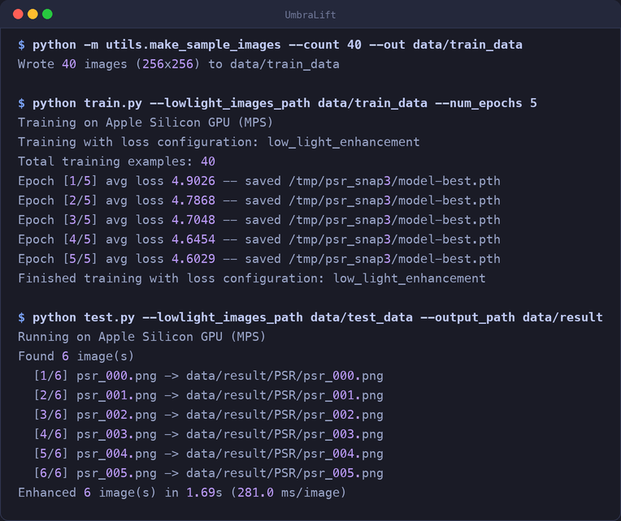
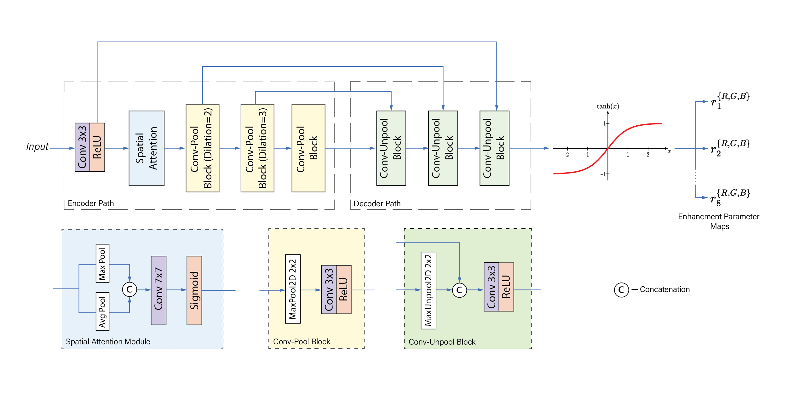
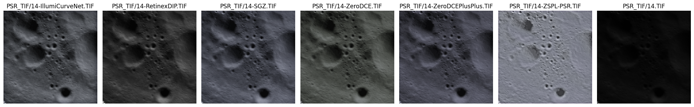

# UmbraLift

Low-light image enhancement for lunar Permanently Shadowed Regions (PSRs).

PSR imagery is close to black, low in contrast, and dominated by sensor noise —
and there are no clean reference images to train against. UmbraLift takes a
**zero-reference** approach: instead of learning a mapping from dark to bright
image pairs, it predicts a set of pixel-wise tone curves and applies them
iteratively, trained entirely by losses that score the *output* on exposure,
colour, contrast, texture and smoothness.

The whole network is **79,516 parameters** — small enough to run comfortably on
a CPU.



## Table of Contents
- [How it works](#how-it-works)
- [Architecture](#architecture)
- [Installation](#installation)
- [Dataset Preparation](#dataset-preparation)
- [Training](#training)
- [Testing](#testing)
- [Metrics](#metrics)
- [Results](#results)
- [Code Structure](#code-structure)

## How it works

The network outputs 24 channels, split into **8 sets of RGB curve parameters**.
Each set is applied as a quadratic tone curve, one after another:

```
x ← x + rₙ · (x² − x)        for n = 1 … 8
```

Iterating a simple curve eight times gives a far more expressive mapping than
one pass, while keeping every step monotonic and differentiable. A learnable
gamma then finishes the adjustment:

```
γ_safe = 0.5 + sigmoid(γ)     ∈ [0.5, 1.5]
output = clamp(x, 1e-7, 1)^γ_safe
```

Because there is no ground truth, training is driven entirely by six losses:

| Loss | Weight | Purpose |
|---|---|---|
| `L_TV` | 200.0 | Smoothness of the curve maps — suppresses noise amplification |
| `L_exp` | 10.0 | Drives mean patch brightness toward a target (0.6) |
| `L_color` | 5.0 | Grey-world colour constancy across channels |
| `L_contrast` | 5.0 | Local contrast toward a target level |
| `L_texture` | 3.0 | Sobel-gradient agreement with the input — preserves detail |
| `L_spa` | 1.5 | Spatial consistency of local gradients |

The heavy `L_TV` weight is the key to PSR work: aggressive brightening
multiplies sensor noise just as much as signal, so the curve maps are strongly
regularised toward smoothness.

## Architecture


<p align="center"><i>Overview of the UmbraLift architecture.</i></p>

An encoder–decoder with a spatial attention gate:

- **Encoder** — a 3→32 convolution, then spatial attention (channel-pooled
  avg/max → 7×7 conv → sigmoid), then dilated convolutions (dilation 2 and 3)
  interleaved with max-pooling, widening the receptive field without extra
  parameters.
- **Decoder** — `MaxUnpool2d` using the indices stored during pooling, with skip
  connections from the matching encoder stage.
- **Head** — a `tanh` layer producing the 24 curve channels.

> **Input dimensions must be divisible by 8.** The encoder pools three times
> with stride 2 and the decoder unpools with the stored indices, so any other
> size raises a shape error. The training loader and `test.py` both handle this
> automatically (resize and centre-crop respectively).

## Installation

```bash
git clone https://github.com/harshdev2909/UmbraLift.git
cd UmbraLift

python -m venv .venv
source .venv/bin/activate      # Windows: .venv\Scripts\activate

pip install -r requirements.txt
```

Requires Python 3.10+. A GPU is optional — the code selects **CUDA → Apple
Silicon (MPS) → CPU** automatically, and any script accepts `--device` to force
one.

## Dataset Preparation

Download the [training dataset](https://www.kaggle.com/datasets/ashishprajapati1306/illumicurvenet-training-data/)
and arrange it as:

```
data/
├── train_data/
│   ├── img1.png
│   └── ...
└── test_data/
    ├── Set1/
    └── Set2/
```

Test images are grouped into subdirectories, one per test set. Both scripts
search recursively and ignore non-image files.

### Trying it without the dataset

To exercise the pipeline end to end, generate synthetic low-light scenes —
crater-like structure at very low exposure with sensor noise:

```bash
python -m utils.make_sample_images --count 40 --out data/train_data
python -m utils.make_sample_images --count 6 --size 320 --out data/test_data/PSR --seed 77
```

These are **not** real lunar data. They verify that training and inference run;
they say nothing about enhancement quality. Quote metrics only from the real
dataset.

## Training

```bash
python train.py --lowlight_images_path data/train_data
```

| Argument | Default | Description |
|---|---|---|
| `--lowlight_images_path` | `data/train_data/` | Training image directory |
| `--num_epochs` | 100 | Maximum epochs |
| `--train_batch_size` | 8 | Batch size |
| `--lr` | 1e-4 | Adam learning rate |
| `--image_size` | 128 | Training crop size (divisible by 8) |
| `--max_train_images` | *all* | Optional cap on images used |
| `--load_pretrain` | off | Flag; resume from `--pretrain_snapshot` |
| `--early_stopping_patience` | 10 | Epochs without improvement before stopping |
| `--device` | auto | Force `cuda`, `mps` or `cpu` |

The best checkpoint is written to `snapshots/model-best.pth` — the same file
`test.py` and the metrics notebook load. Periodic checkpoints go to
`checkpoints/`.

Training uses gradient clipping (norm 1.0), skips any iteration producing a NaN
loss, and stops early when the average epoch loss plateaus. Note that early
stopping tracks *training* loss; there is no held-out split, so it detects
convergence rather than overfitting.

## Testing

```bash
python test.py --lowlight_images_path data/test_data --output_path data/result
```

| Argument | Default | Description |
|---|---|---|
| `--lowlight_images_path` | `data/test_data/` | Input directory, searched recursively |
| `--pretrain_snapshot` | `snapshots/model-best.pth` | Checkpoint to load |
| `--output_path` | mirrors input | Output directory |
| `--device` | auto | Force `cuda`, `mps` or `cpu` |

Enhanced images are written mirroring the input directory structure. The model
is loaded once and reused across all images.

## Metrics

`metrics.ipynb` evaluates a folder of images with three **no-reference** quality
metrics via [pyiqa](https://github.com/chaofengc/IQA-PyTorch) — no ground truth
required, which is what makes them usable for PSR data:

- **PIQE** — Perception-based Image Quality Evaluator
- **NIQE** — Naturalness Image Quality Evaluator
- **BRISQUE** — Blind/Referenceless Image Spatial Quality Evaluator

All three are lower-is-better. The notebook prints the mean across the folder
and displays a before/after pair.

## Results

No-reference quality on the PSR test set (lower is better):

| Method | Input | Zero-DCE | Zero-DCE++ | ZSPL-PSR | RRDNet | RetinexDIP | UmbraLift |
|---------|--------|-----------|------------|-----------|---------|------------|----------------|
| PIQE↓ | 54.06 | 51.11 | 51.59 | 47.51 | 52.55 | 52.61 | **36.40** |
| NIQE↓ | 12.07 | 9.67 | 9.75 | 9.29 | 10.01 | 9.80 | **8.38** |
| BRISQUE↓ | 56.87 | 45.58 | 46.42 | 54.91 | 43.16 | 43.11 | **36.55** |

The UmbraLift column reproduces from this repository: run `metrics.ipynb`
against the PSR test set with the shipped checkpoint. The baseline columns are
carried over from the original evaluation of this method — those models are not
included here, so their figures cannot be regenerated from this repository.


<p align="center"><i>Comparison of enhancement methods on PSR images.</i></p>

## Code Structure

```
model.py                      network architecture
train.py                      training loop
test.py                       batch inference
metrics.ipynb                 no-reference quality evaluation
utils/dataloader.py           dataset and preprocessing
utils/losses.py               the six training losses
utils/device.py               CUDA / MPS / CPU selection
utils/make_sample_images.py   synthetic low-light generator
snapshots/model-best.pth      trained checkpoint (323 KB)
diagrams/                     architecture and comparison figures
```

## Credits

The network architecture, loss formulation and trained checkpoint originate
from prior work by Ashish Prajapati and collaborators, released under the MIT
license. This repository builds on that: device-agnostic training and
inference, a corrected data pipeline, and the tooling and documentation around
it.

The [training dataset](https://www.kaggle.com/datasets/ashishprajapati1306/illumicurvenet-training-data/)
is published by the original authors.

## License

MIT — see [LICENSE](LICENSE). Copyright is held jointly by the original author
and subsequent contributors; the MIT terms require the original notice be kept
in any copy.
